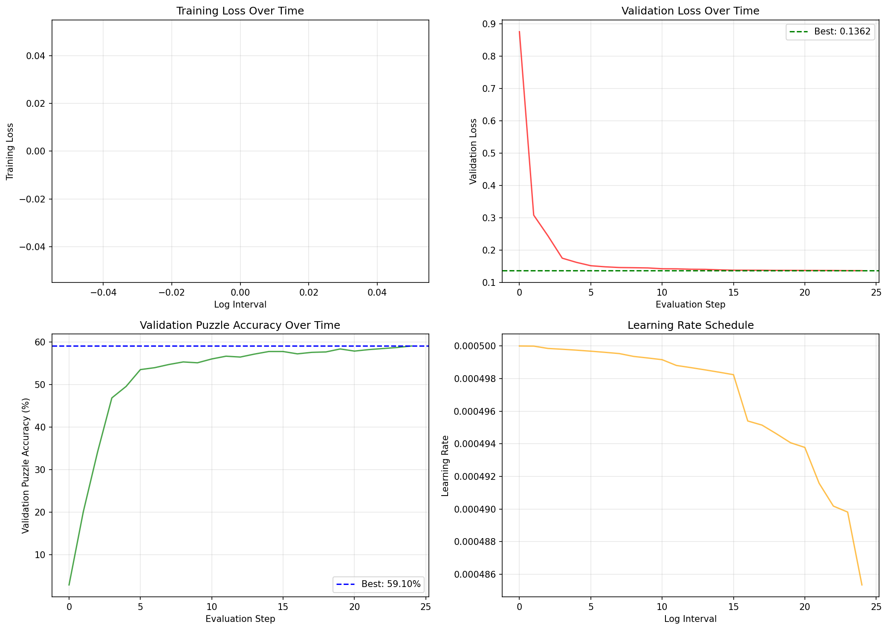
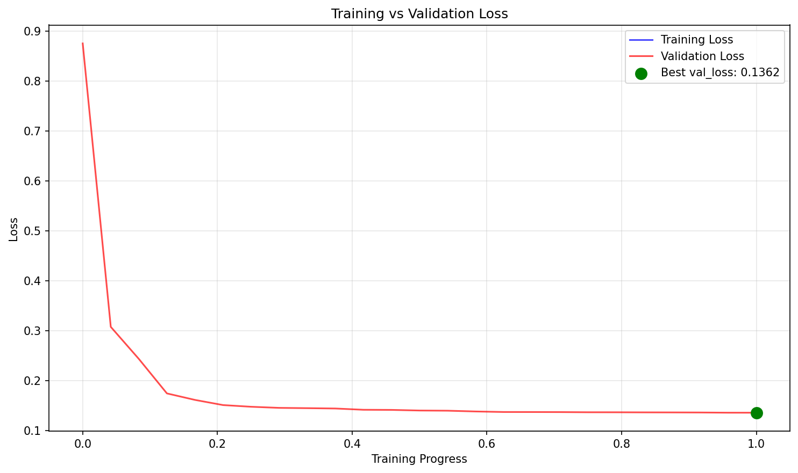
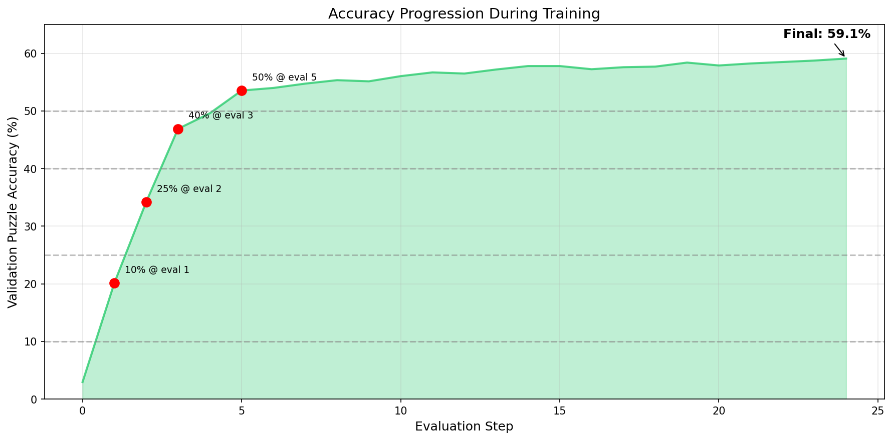
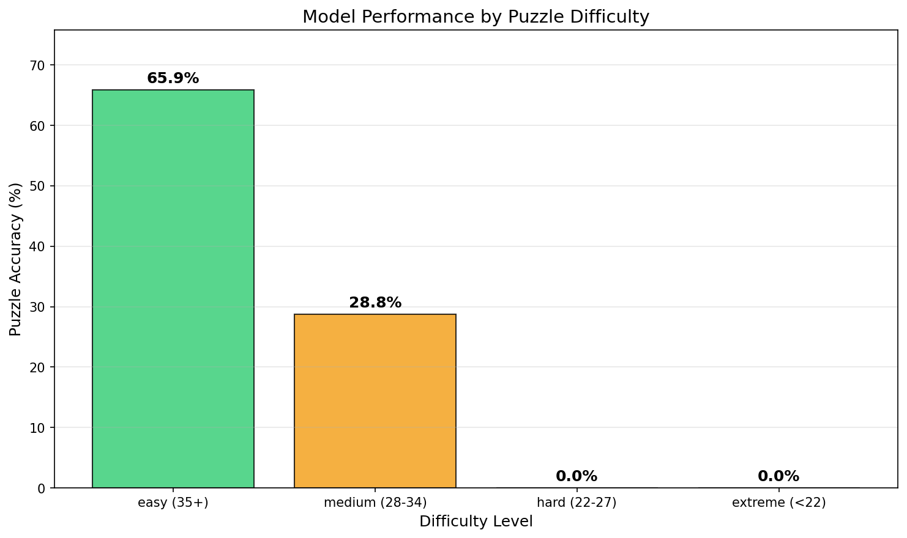
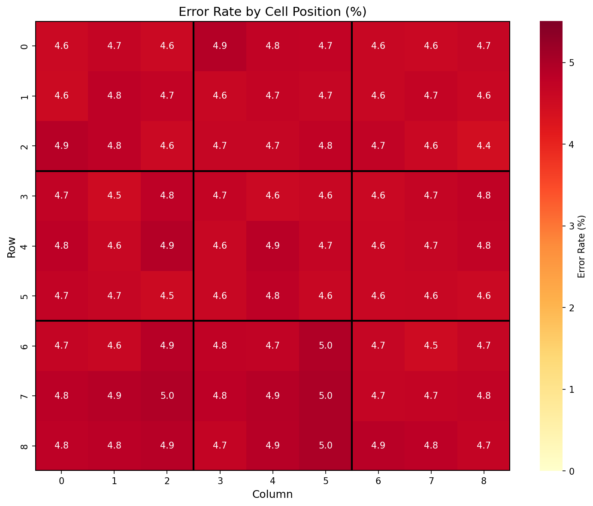
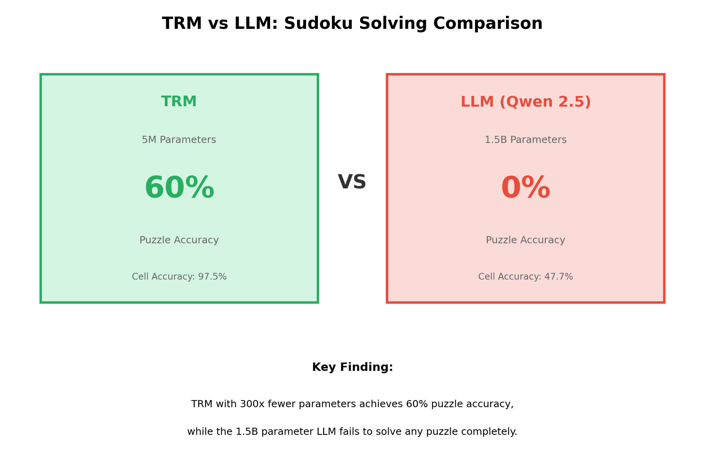
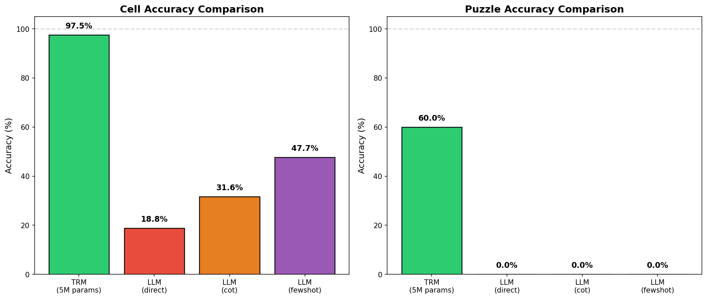
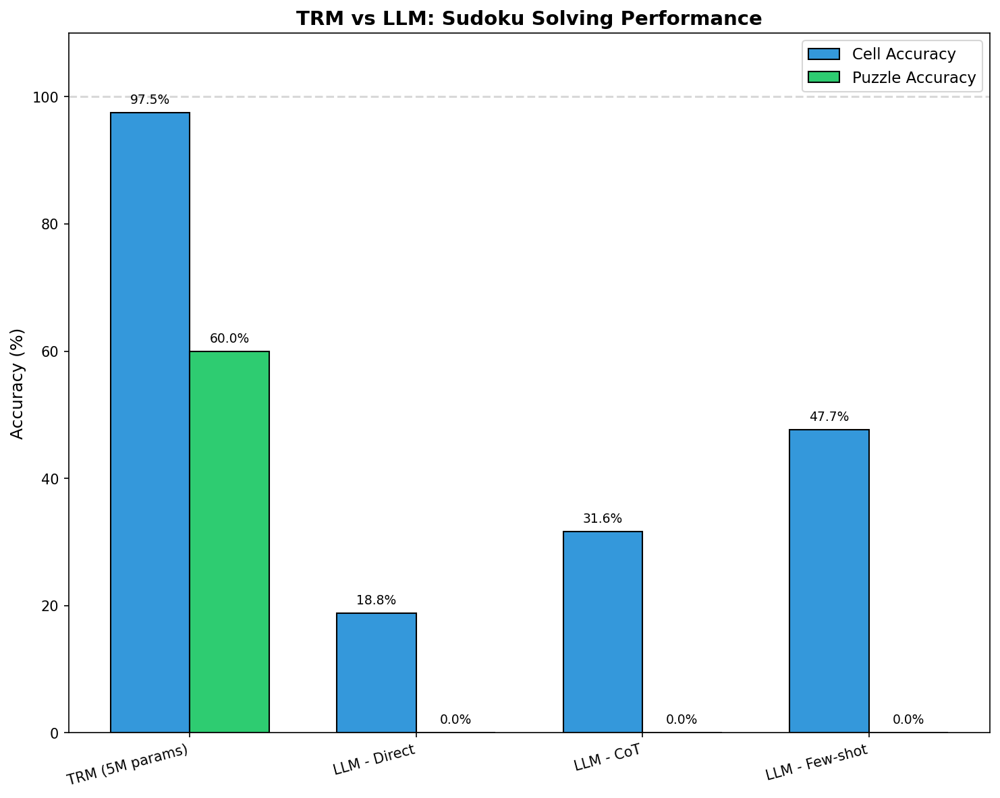
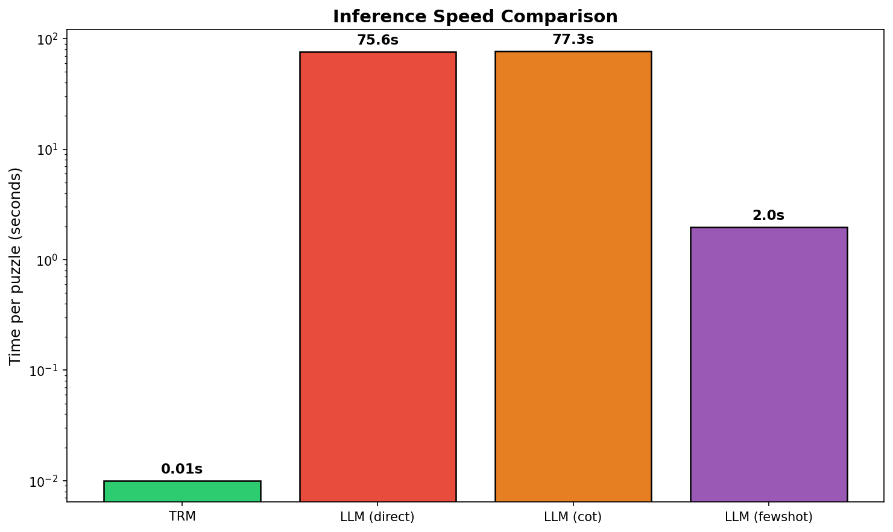
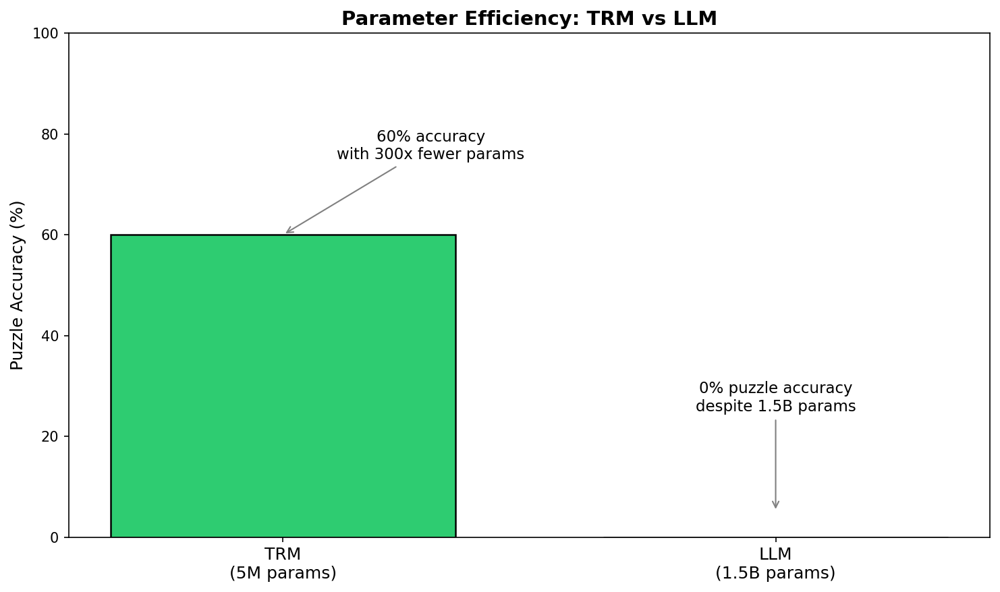

# TRM: Tiny Reasoning Model for Sudoku

A PyTorch implementation of a Tiny Reasoning Model (TRM) for solving Sudoku puzzles, based on the paper ["Less is More: Recursive Reasoning with Tiny Networks"](https://arxiv.org/abs/2503.08890).

This project demonstrates that a small, specialized neural network (~5M parameters) can significantly outperform large language models (1.5B+ parameters) on structured reasoning tasks like Sudoku solving.

---

## Table of Contents

- [Overview](#overview)
- [Key Results](#key-results)
- [Architecture](#architecture)
- [Installation](#installation)
- [Usage](#usage)
  - [Training](#training)
  - [Evaluation](#evaluation)
  - [LLM Comparison](#llm-comparison)
  - [Visualization](#visualization)
- [Configuration](#configuration)
- [Project Structure](#project-structure)
- [Results and Analysis](#results-and-analysis)
  - [Training Performance](#training-performance)
  - [Evaluation Metrics](#evaluation-metrics)
  - [TRM vs LLM Comparison](#trm-vs-llm-comparison)
  - [Key Findings](#key-findings)
- [Hardware Requirements](#hardware-requirements)

---

## Overview

The Tiny Reasoning Model (TRM) is a compact neural network designed for recursive reasoning tasks. Unlike large language models that rely on massive parameter counts and broad training data, TRM uses:

- **Recursive computation**: Multiple passes through shared-weight layers
- **Deep supervision**: Loss computed at each recursion step
- **Sudoku-specific augmentations**: Rotation, reflection, digit relabeling, and block permutation
- **Adaptive Computation Time (ACT)**: Dynamic halting based on confidence

The result is a model that achieves **59.1% puzzle accuracy** on Sudoku while using **300x fewer parameters** than comparable LLMs.

---

## Key Results

| Model | Parameters | Puzzle Accuracy | Cell Accuracy |
|-------|------------|-----------------|---------------|
| **TRM (Ours)** | **5.16M** | **59.1%** | **95.3%** |
| Qwen 2.5 (Direct) | 1,500M | 0% | 18.8% |
| Qwen 2.5 (CoT) | 1,500M | 0% | 31.6% |
| Qwen 2.5 (Few-shot) | 1,500M | 0% | 47.7% |

**TRM solves 59% of puzzles completely, while the 1.5B parameter LLM fails to solve any puzzle correctly.**

---

## Architecture

```
Input (81 cells) → Embedding → TRM Layers (×2, shared weights) → Output Head → Predictions
                                    ↑                    ↓
                              Latent recursion (n=6 times per deep step)
                                    ↑                    ↓
                              Deep recursion (T=3 steps with supervision)
```

### Key Components

| Component | Description |
|-----------|-------------|
| **Hidden Dimension** | 512 |
| **TRM Layers** | 2 (with shared weights for recursion) |
| **Latent Recursions (n)** | 6 per deep step |
| **Deep Steps (T)** | 3 (with supervision at each step) |
| **Normalization** | RMSNorm |
| **Activation** | SwiGLU |
| **Total Parameters** | ~5.16M |

---

## Installation

### Prerequisites

- Python 3.10+
- CUDA-capable GPU (tested on NVIDIA T4 with 16GB VRAM)
- [Ollama](https://ollama.ai/) (optional, for LLM comparison)

### Setup

```bash
# Clone the repository
git clone <repository-url>
cd trm-sudoku-agi-model

# Install uv (if not already installed)
curl -LsSf https://astral.sh/uv/install.sh | sh

# Create virtual environment and install dependencies
uv venv
source .venv/bin/activate  # On Windows: .venv\Scripts\activate
uv sync
```

---

## Usage

The project provides a unified CLI through `main.py`:

```bash
python main.py <command> [options]
```

### Training

Train the TRM model on Sudoku puzzles:

```bash
# Train with default configuration
python main.py train

# Train with custom config
python main.py train --config configs/default.yaml

# Override specific parameters
python main.py train --epochs 1000 --batch-size 4096
```

**Training outputs:**
- `outputs/best.pt` - Best model checkpoint (by validation loss)
- `outputs/final.pt` - Final model checkpoint
- `outputs/history.json` - Training metrics history
- `outputs/config.json` - Configuration used for training

### Evaluation

Evaluate a trained model on the test set:

```bash
# Basic evaluation
python main.py evaluate outputs/best.pt

# With more test samples
python main.py evaluate outputs/best.pt --n-samples 5000

# Show example predictions
python main.py evaluate outputs/best.pt --show-examples
```

**Evaluation outputs:**
- `outputs/eval_results.json` - Detailed evaluation metrics

### LLM Comparison

Compare TRM performance against local LLMs via Ollama:

```bash
# Start Ollama server first
ollama serve

# Run comparison
python main.py compare outputs/best.pt --llm-model qwen2.5:1.5b --n-puzzles 5

# Save results
python main.py compare outputs/best.pt --llm-model qwen2.5:1.5b --output outputs/llm_comparison.json
```

**Supported LLM strategies:**
- `direct` - Direct prompting
- `cot` - Chain-of-thought prompting
- `fewshot` - Few-shot prompting with examples

### Visualization

Generate training and comparison visualizations:

```bash
# Visualize training history
python main.py visualize

# Visualize TRM vs LLM comparison
python main.py visualize-comparison

# Custom paths
python main.py visualize --history outputs/history.json --output-dir outputs/plots
python main.py visualize-comparison --comparison outputs/llm_comparison.json
```

### Project Info

```bash
python main.py info
```

---

## Configuration

The default configuration is in `configs/default.yaml`:

```yaml
# Model Architecture
model:
  hidden_dim: 512
  n_latent: 6        # Latent recursions per deep step
  T_deep: 3          # Deep recursion steps
  use_act: true      # Adaptive Computation Time

# Training (optimized for T4 GPU)
training:
  epochs: 3000
  train_samples: 5000
  augmentations_per_sample: 1000
  batch_size: 20480
  learning_rate: 0.0005
  weight_decay: 1.0
  warmup_steps: 400
  early_stopping: true
  early_stopping_patience: 50

# Mixed Precision
  use_amp: true
  amp_dtype: float16
```

### Key Hyperparameters

| Parameter | Value | Notes |
|-----------|-------|-------|
| `batch_size` | 20480 | Optimized for T4 (16GB VRAM) |
| `learning_rate` | 0.0005 | Scaled with batch size |
| `weight_decay` | 1.0 | Strong regularization prevents overfitting |
| `augmentations_per_sample` | 1000 | Creates 5M training samples from 5K puzzles |
| `early_stopping_patience` | 50 | Stops when validation loss plateaus |

---

## Project Structure

```
trm-sudoku-agi-model/
├── main.py                     # CLI entry point
├── configs/
│   └── default.yaml            # Default configuration
├── scripts/
│   ├── train.py                # Training script
│   ├── evaluate.py             # Evaluation script
│   ├── compare_llm.py          # LLM comparison script
│   ├── visualize.py            # Training visualization
│   └── visualize_comparison.py # TRM vs LLM visualization
├── src/
│   ├── model/
│   │   ├── layers.py           # RMSNorm, SwiGLU
│   │   └── trm.py              # TRM architecture
│   ├── data/
│   │   ├── dataset.py          # Sudoku dataset loader
│   │   └── augmentation.py     # Sudoku augmentations
│   ├── training/
│   │   ├── trainer.py          # Training loop
│   │   └── ema.py              # Exponential Moving Average
│   └── evaluation/
│       ├── metrics.py          # Accuracy metrics
│       └── llm_comparison.py   # Ollama LLM interface
├── outputs/                    # Training outputs
│   ├── best.pt                 # Best model checkpoint
│   ├── history.json            # Training history
│   ├── eval_results.json       # Evaluation results
│   └── llm_comparison.json     # LLM comparison results
└── pyproject.toml              # Project dependencies
```

---

## Results and Analysis

### Training Performance

The model was trained for **372 epochs** (~34 hours on T4 GPU) before early stopping triggered.

#### Training Progression

| Epoch | Validation Loss | Puzzle Accuracy |
|-------|-----------------|-----------------|
| 1 | 0.875 | 2.95% |
| 10 | 0.175 | 46.9% |
| 50 | 0.145 | 55.4% |
| 100 | 0.140 | 57.2% |
| 200 | 0.137 | 58.4% |
| 330 (Best) | 0.136 | **59.1%** |
| 372 (Final) | 0.136 | 59.1% |

#### Training Statistics

| Metric | Value |
|--------|-------|
| Total Training Time | 33.9 hours |
| Final Epoch | 372 / 3000 |
| Total Steps | 90,768 |
| Best Validation Loss | 0.1362 |
| Best Puzzle Accuracy | 59.1% |
| Early Stopping | Yes (patience=50) |

#### Training Curves







### Evaluation Metrics

Evaluation on 50,000 test puzzles:

| Metric | Value |
|--------|-------|
| **Puzzle Accuracy** | 56.5% |
| **Cell Accuracy** | 95.3% |
| Empty Cell Accuracy | 90.1% |
| Given Cells Preserved | 99.99% |

#### Performance by Difficulty

| Difficulty | Givens | Puzzle Accuracy |
|------------|--------|-----------------|
| Easy | 35+ | **65.9%** |
| Medium | 28-34 | **28.8%** |
| Hard | 22-27 | 0% |
| Extreme | <22 | 0% |

The model excels at easy puzzles but struggles with harder ones that require deeper logical chains.

#### Constraint Violations

| Constraint | Violation Rate |
|------------|----------------|
| Row | 12.4% |
| Column | 12.4% |
| Box | 10.7% |

#### Evaluation Visualizations






### TRM vs LLM Comparison

Direct comparison on 5 test puzzles:

#### Accuracy Comparison

| Model | Strategy | Cell Accuracy | Puzzle Accuracy |
|-------|----------|---------------|-----------------|
| **TRM** | - | **97.5%** | **60%** |
| Qwen 2.5 (1.5B) | Direct | 18.8% | 0% |
| Qwen 2.5 (1.5B) | Chain-of-Thought | 31.6% | 0% |
| Qwen 2.5 (1.5B) | Few-shot | 47.7% | 0% |

#### Speed Comparison

| Model | Time per Puzzle |
|-------|-----------------|
| **TRM** | **~0.01s** |
| Qwen 2.5 (Direct) | 75.6s |
| Qwen 2.5 (CoT) | 77.3s |
| Qwen 2.5 (Few-shot) | 2.0s |

TRM is **7,500x faster** than the LLM with chain-of-thought prompting.

#### Parameter Efficiency

| Model | Parameters | Puzzle Accuracy | Acc/Million Params |
|-------|------------|-----------------|-------------------|
| **TRM** | 5.16M | 60% | **11.6%** |
| Qwen 2.5 | 1,500M | 0% | 0% |

#### Comparison Visualizations











### Key Findings

1. **Specialized beats General**: A 5M parameter model trained specifically for Sudoku outperforms a 1.5B parameter general-purpose LLM (300x more parameters).

2. **Prompting Strategy Matters**: For LLMs, few-shot prompting (47.7% cell accuracy) significantly outperforms direct prompting (18.8%), but still fails to solve complete puzzles.

3. **Recursive Reasoning Works**: The TRM's recursive architecture (6 latent + 3 deep recursions) enables iterative refinement that improves accuracy.

4. **Difficulty Scaling**: TRM handles easy puzzles well (65.9%) but struggles with hard puzzles (0%), suggesting limitations in deep logical reasoning chains.

5. **Data Augmentation is Critical**: Using 1000 augmentations per sample (rotation, reflection, digit relabeling, block permutation) effectively increases training data from 5K to 5M samples.

6. **Strong Regularization Prevents Overfitting**: Weight decay of 1.0 combined with early stopping prevents the model from memorizing training data.

### What Worked Best

- **Large batch size** (20480) with scaled learning rate for stable training
- **Heavy augmentation** (1000x) to maximize data diversity
- **Strong weight decay** (1.0) to prevent overfitting
- **Early stopping** to avoid overtraining
- **EMA weights** for smoother, more robust predictions
- **Deep supervision** at each recursion step

### What Could Be Improved

- **Hard puzzle performance**: Model achieves 0% on hard/extreme puzzles
- **Constraint satisfaction**: ~12% violation rate suggests room for improvement
- **Training time**: 34 hours is significant; could explore more efficient training

---

## Hardware Requirements

This project is configured and tested on **NVIDIA T4 GPU** (16GB VRAM).

| Resource | Recommended | Minimum |
|----------|-------------|---------|
| GPU VRAM | 16GB | 8GB |
| System RAM | 16GB | 8GB |
| Storage | 10GB | 5GB |

### Adjusting for Different Hardware

**For smaller GPUs (8GB VRAM):**
```yaml
training:
  batch_size: 8192  # Reduce from 20480
  learning_rate: 0.0003  # Scale down proportionally
```

**For larger GPUs (24GB+ VRAM):**
```yaml
training:
  batch_size: 32768  # Increase batch size
  learning_rate: 0.0007  # Scale up proportionally
```

---

## Acknowledgments

- Based on the paper: ["Less is More: Recursive Reasoning with Tiny Networks"](https://arxiv.org/abs/2503.08890)
- Dataset: [Ritvik19/Sudoku-Dataset](https://huggingface.co/datasets/Ritvik19/Sudoku-Dataset) on Hugging Face
- LLM comparison via [Ollama](https://ollama.ai/)
